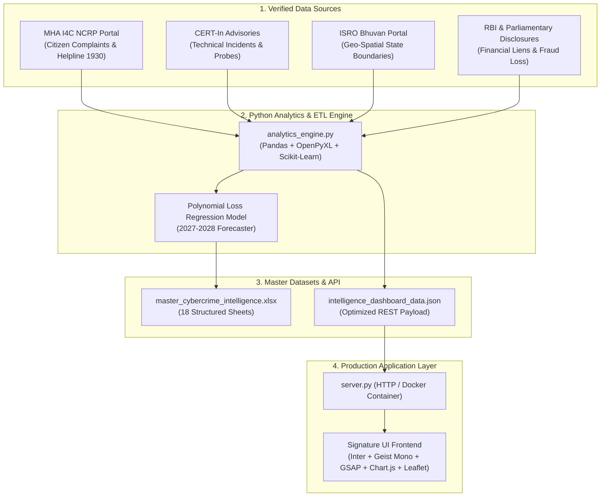

# Cyber Jagruti (2020–2026 YTD)

> **Cyber Jagruti — Enterprise National Threat Assessment & Spatial Risk Analytics Engine**  
> **Researched & Engineered by [M Tejas Yadav](https://github.com/tejassxo)**

[](https://github.com/tejassxo/CyberJagruti/actions)
[](LICENSE)
[](https://www.python.org/)
[](styles.css)

---

## 📌 Executive Summary

**Cyber Jagruti** is a production-grade cyber threat analytics platform synthesizing **95.42+ Lakh citizen NCRP complaints**, **₹68,500 Crore in reported financial cyber losses**, and **1.33+ Crore CERT-In technical security incidents** across all 36 States and Union Territories of India from 1 January 2020 through July 2026.

Built on the **Signature UI** design philosophy (**Engineering Precision, Neutral Foundation, Zero Gradients, Inter & Geist Mono Typography, Structured 12-Column Grid**), the platform provides mission-critical telemetry for technical leadership, security operations centers (SOC), and regulatory compliance audits.

---

## 🏗️ System Architecture & Data Lineage



---

## 🌟 Key Engineering Highlights

### 1. **Signature UI Design System**
* **Engineering Precision**: Functional, structured, and intentional component language—zero decorative clutter or cyberpunk gimmicks.
* **Light-First Foundation**: Crisp neutral palette (`#FAFAFA` base, `#09090B` text) with a single controlled accent (`#2563EB` Precision Blue) and executive dark mode toggle.
* **Typographic Hierarchy**: Primary UI in **Inter** with technical metadata, financial amounts, and IDs strictly formatted in **Geist Mono**.
* **Purposeful GSAP Motion**: Smooth layout state reveals and micro-interactions without distracting animation overhead.

### 2. **ISRO Bhuvan Geo-Spatial Choropleth Engine**
* High-resolution polygon boundaries strictly bounded to the territory of India (`maxBoundsViscosity: 1.0`).
* Risk choropleth dynamic recalculation sorting across **Financial Loss (₹ Cr)**, **NCRP Complaint Volumes**, and **Vulnerability Index Scores**.

### 3. **Forensic Deep-Dive & Taxonomy Modules**
* **Digital Arrest Spotlight**: 4-stage operational breakdown of cross-border extortion syndicates operating from Southeast Asia compounds.
* **MITRE ATT&CK Enterprise Matrix**: Attack procedures, observed technique IDs, and frequency mapped specifically to Indian financial and critical infrastructure targets.
* **Master OSINT Repository Grid**: 114 verified case files with multi-column filtering, search, and direct Excel workbook export.

---

## 🛠️ Technology Stack

| Layer | Technologies |
| :--- | :--- |
| **Frontend Core** | HTML5, Vanilla CSS3 (Custom Design Tokens), JavaScript (ES6+), Tailwind CSS |
| **Motion & Charts** | GSAP 3.12 (Transitions), Chart.js 4 (Dual-Axis Trends & Doughnuts) |
| **Geospatial Mapping** | Leaflet.js, ISRO Bhuvan Spatial Geometry, GeoJSON Polygon Engine |
| **Backend & Analytics** | Python 3.11+, Pandas, OpenPyXL, Scikit-Learn, SocketServer |
| **Deployment** | Python Server (Port 8080), Vercel Static, Docker Multi-Stage, GitHub Actions CI/CD |

---

## 🚀 Deployment & Local Execution

### 1. Local Development
```bash
# Clone the repository
git clone https://github.com/tejassxo/CrimeIntel.git
cd CrimeIntel

# Start the local server
python server.py
# -> Accessible at http://localhost:8080
```

### 2. Vercel Static Deployment
* **Framework Preset**: Select **Other** (or automatic static detection)
* **Root Directory**: `./`
* Vercel will serve `index.html`, `styles.css`, and `app.js` with the security headers defined in `vercel.json`.

### 3. Docker Container Deployment
```bash
# Build the production container image
docker build -t cyber-jagruti:latest .

# Run the container
docker run -d -p 8080:8080 --name cyber-jagruti-prod cyber-jagruti:latest
```

---

## 🛡️ License
Released under the **MIT License**. Researched and developed by **M Tejas Yadav (tejassxo)**.

## 📜 Official Data Sources

All incident records, financial losses, and mitigation metrics are synthesized from official public disclosures:
* **MHA I4C NCRP Portal**: [cybercrime.gov.in](https://cybercrime.gov.in/) & [i4c.mha.gov.in](https://i4c.mha.gov.in/)
* **CERT-In Advisories**: [cert-in.org.in](https://www.cert-in.org.in/)
* **National Crime Records Bureau (NCRB)**: [ncrb.gov.in](https://ncrb.gov.in/)
* **ISRO Bhuvan Geo-Portal**: [bhuvan.nrsc.gov.in](https://bhuvan.nrsc.gov.in/)

---

## 👤 Engineering Attribution

* **Researched & Engineered by**: [M Tejas Yadav](https://github.com/tejassxo)
* **GitHub Profile**: [@tejassxo](https://github.com/tejassxo)
* **Role Focus**: Custom Software Engineering (SWE), Data Analytics & Mission-Critical Systems Architecture
* **License**: MIT License
